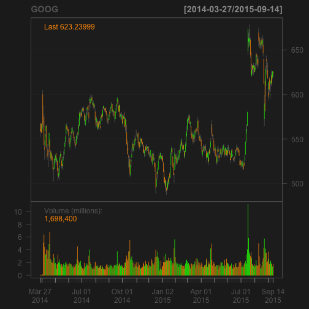

Quantitative Financial Analysis
========================================================
author: Alexander Loth (@xlth)
date: 2015-09-15

Abstract
========================================================

This Shiny application helps to analyze different financial assets.
In order to perform a technical analysis of the selected asset various chart types and technical indicators are available:

- Candle charts of the close price in time series
- Technical indicators like EMA, ATR, RSI, MACD...
- Kolmogorv-Smirnoff statistics

Packages
========================================================

We use TTR, xts, VGAM and quantmod packages in order to get the data and to make the technical analysis: To get the data we use getSymbols() function:


```r
library(quantmod)
library(xts)
library(TTR)
library(VGAM)
getSymbols("^GDAXI")
```

```
[1] "GDAXI"
```

Once we get the data we can plot them with candleChart() function and include technical indicators with addTA() and the indicator selected. (see also: http://www.rdocumentation.org/packages/TTR)

Charts
========================================================

We receive daily stock quotes from Yahoo Finance. The application gives you the possibility to enter the Yahoo Finance symbol such as "GDAXI", "GOOG", "AAPL", ...

 

Kolmogorv-Smirnoff Test
========================================================

The Kolmogorov–Smirnov test is a nonparametric test of the equality of continuous, one-dimensional probability distributions that can be used to compare a sample with a reference probability distribution. The distributions considered under the null hypothesis are continuous distributions but are otherwise unrestricted.


```r
ks.test(c(0, 1, 0, 0), "plaplace", 0.1, 0.5)
```

```

	One-sample Kolmogorov-Smirnov test

data:  c(0, 1, 0, 0)
D = 0.40937, p-value = 0.514
alternative hypothesis: two-sided
```
